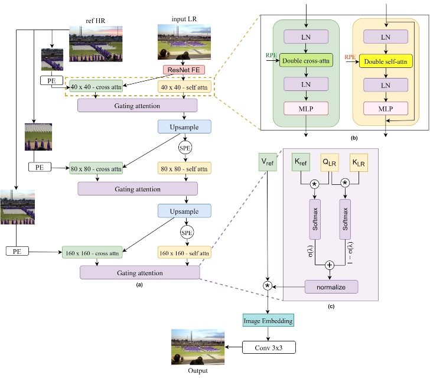

# DARTS

This repository contains the implementation of the following paper:
> **DARTS: Double Attention Reference-based Transformer for Super-resolution**<br>
> Masoomeh Aslahishahri, Jordan Ubbens, Ian Stavness<br>

[[Paper](https://arxiv.org/pdf/2307.08837.pdf)]

## Overview


## Dependencies and Installation

1. Clone Repo

   ```bash
   git clone https://github.com/bia006/DARTS.git
   ```

2. Create Conda Environment
   ```bash
   conda create --name DARTS python=3.8
   conda activate DARTS
   ```

3. Install Dependencies

   ```bash
   cd DARTS
   pip install -r requirements.txt
   ```

## Dataset Preparation

- Train Set: [CUFED Dataset](https://drive.google.com/drive/folders/1hGHy36XcmSZ1LtARWmGL5OK1IUdWJi3I)
- Test Set: [WR-SR Dataset](https://drive.google.com/drive/folders/16UKRu-7jgCYcndOlGYBmo5Pp0_Mq71hP?usp=sharing), [CUFED5 Dataset](https://drive.google.com/file/d/1Fa1mopExA9YGG1RxrCZZn7QFTYXLx6ph/view)

Please refer to [Datasets.md](datasets/DATASETS.md) for pre-processing and more details.

## Get Started

### Pretrained Models
Downloading the pretrained models from this [link](https://drive.google.com/file/d/1VWQH3FFhc8ZqDilVfXzlZS99qaF3om0-/view?usp=sharing) and put them under `mmsr/checkpoints folder`.

### Test

We provide quick test code with the pretrained model.

1. Modify the paths to dataset and pretrained model in the following yaml files for configuration.

    ```bash
    ./options/test/test_DARTS.yml
    ```

2.  Check out the results in `./results`.


### Train

All logging files in the training process, *e.g.*, log message, checkpoints, and snapshots, will be saved to `./mmsr/checkpoints` and `./tb_logger` directory.

1. Modify the paths to dataset in the following yaml files for configuration.
   ```bash
   ./options/train/train_DARTS.yml
   ```

2. Train the transformer network.
   ```bash
   python mmsr/train.py -opt "options/train/train_DATSR.yml"
   ```
   
   ## Visual Results

For more results on the benchmarks, you can directly download our DARTS results from [here](https://drive.google.com/file/d/1Q-wVgMd4ByG5HvY1D9YPv9eWE8aYPUuR/view?usp=sharing).


## Citation

   If you find our repo useful for your research, please cite our paper.


## License and Acknowledgement

This project is open sourced under MIT license. The code framework is mainly modified from [StyleSwin](https://github.com/microsoft/StyleSwin). Please refer to the original repo for more usage and documents.


## Contact

If you have any question, please feel free to contact us via `masi.aslahi@usask.ca`.

